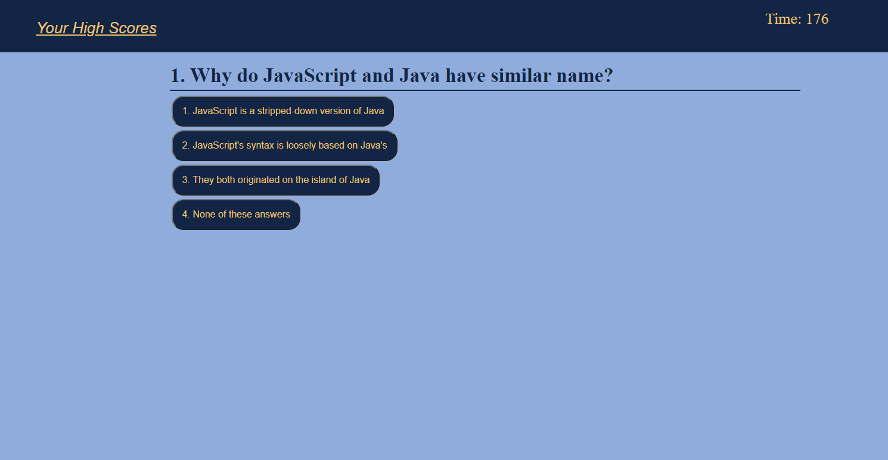
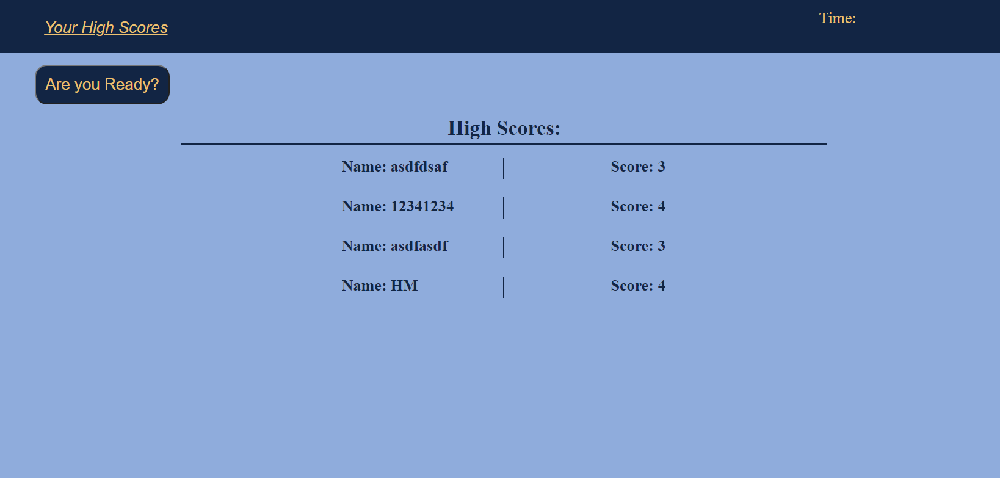

# coding-quiz

## Purpose
To assess how well I am understanding javascript principles.

## sources

[the questions can be found here](http://mcqspdfs.blogspot.com/2013/08/60-top-javascript-multiple-choice.html)

## Made by:
# Josh Miller

### [Where can you find the project](sithSlave.github.io/coding-quiz/)

### Screenshots
#### 
#### 
#### 

